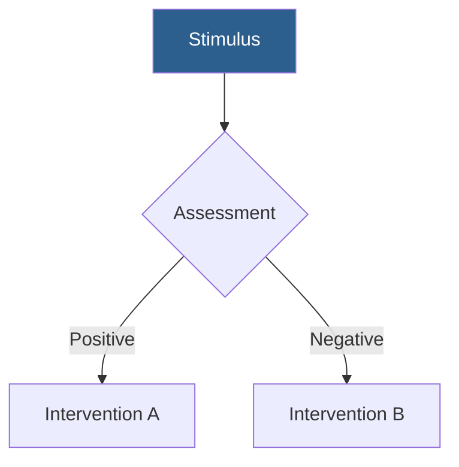

<objective>
Create professional, scientifically accurate biomedical presentations using MARP (Markdown Presentation Ecosystem) with proper PubMed citations, contextual image sourcing, professional themes, and evidence-based content. Transform biomedical research and clinical knowledge into compelling, educational presentations suitable for conferences, training, and academic seminars.
</objective>

<quick_start>
<essential_workflow>
1. **Read reference files** (do this FIRST):
   - `references/marp-syntax.md` - MARP syntax
   - `references/biomedical-presentation-guidelines.md` - Scientific presentation best practices
   - `references/citation-formatting.md` - Citation standards
   - `references/pubmed-mcp-usage.md` - PubMed MCP priority guidance
   - `references/contextual-image-retrieval.md` - Subtopic-based image search (RECOMMENDED)

2. **Analyze request**: Extract topic, audience, duration, key points, image sources

3. **Research with PubMed MCP** (if available) OR use web_search as fallback

4. **Configure contextual image search**: Create subtopics.json for each presentation section

5. **Select theme**: default-biomedical (general), clinical-education (training), research-seminar (academic), dark-scientific (modern)

6. **Structure presentation**: Follow 70% concise slides, 30% explanatory slides pattern

7. **Create Mermaid diagrams** for pathways and mechanisms

8. **Save to `/mnt/user-data/outputs/presentation_name.md`**
</essential_workflow>
</quick_start>

<context>
<trigger_conditions>
Invoke this skill when:
- User requests scientific presentation on biomedical topic
- User asks for presentation after analyzing journal article or research
- User requests presentation for clinical education or medical training
- User explicitly mentions MARP presentations
- User provides structured presentation brief with topics, objectives, and requirements
- User needs conference talk, research seminar, or grand rounds presentation
</trigger_conditions>

<target_audiences>
- Medical students and residents
- Researchers and academics
- Clinical practitioners
- CME/continuing education participants
- Conference attendees
</target_audiences>
</context>

<workflow>
<step number="1">
<title>Read Essential References</title>

ALWAYS read these files BEFORE starting (critical for success):
- `references/marp-syntax.md`
- `references/biomedical-presentation-guidelines.md`
- `references/citation-formatting.md`
- `references/pubmed-mcp-usage.md` (IMPORTANT: PubMed MCP priority guidance)
- `references/contextual-image-retrieval.md` (RECOMMENDED: Subtopic-based contextual image search)
- `references/openi-advanced-search.md` (when specific image types needed: CT, MRI, diagrams)
</step>

<step number="2">
<title>Understand the Request</title>

Analyze user's request to determine:
- **Topic and scope**: Main subject and boundaries
- **Target audience**: Residents? Researchers? Medical students?
- **Duration**: 30, 60, or 90 minutes?
- **Key learning objectives**: What should audience learn?
- **Required content**: Specific subtopics, keywords, competencies
- **Image sources**: JSON/CSV library? PMC? Open-I? User-provided?

See `references/request-formats.md` for parsing structured and unstructured requests.
</step>

<step number="3">
<title>Gather Scientific Information</title>

<priority_method>
**ALWAYS check for PubMed MCP first**. If available, use it for all literature searches.
</priority_method>

<pubmed_mcp>
**When PubMed MCP is available** (PREFERRED):
- Use MCP tools for structured PubMed queries
- Retrieve article metadata (title, authors, abstract, PMID, DOI)
- Access full-text when available
- Extract citations directly from MCP results
- Use Medical Subject Headings (MeSH) terms

Read `references/pubmed-mcp-usage.md` for complete MCP workflow.
</pubmed_mcp>

<web_search_fallback>
**When PubMed MCP is NOT available**:
- Use `web_search` to find PubMed articles
- Search for recent reviews and meta-analyses
- Find primary research supporting claims
- Identify clinical guidelines
- Look for high-quality figures

**Citation requirement**: EVERY factual claim needs PubMed citation regardless of search method.
</web_search_fallback>
</step>

<step number="4">
<title>Source Images with Contextual Matching</title>

<contextual_retrieval>
**PRIORITY: Use contextual subtopic-based search for maximum relevance**

Best approach for multi-subtopic presentations:
1. **Identify subtopics** from presentation structure
2. **Create configuration** (`subtopics.json`) with context for each section
3. **Run contextual fetcher**: `python scripts/pmc_contextual_fetcher.py --config subtopics.json --output ./images --create-library`
4. **Use matched figures** organized by subtopic with relevance scores

**Why contextual is better**:
- Semantic matching using TF-IDF similarity on figure descriptions (`fig_desc`)
- Context-aware figure selection for each subtopic
- Relevance scoring (0.0-1.0) for quality control
- Different relevant images for each presentation section

Read `references/contextual-image-retrieval.md` for complete guide.
</contextual_retrieval>

<alternative_sources>
**Option B - User-provided JSON/CSV library**:
```bash
python scripts/image_sourcer.py /path/to/image_library.json "TMS coil" --max-results 5 --width 600
```
Use EXACT paths from JSON's `path` field.

**Option C - Enhanced Open-I search** (specific modalities/specialties):
```bash
python scripts/openi_advanced_search.py --query "brain tumor" --modality mri --specialty neurology --download --create-library
```
Available filters: modality (ct, mri, xray, ultrasound, pet, microscopy, illustration), specialty (cardiology, neurology, oncology, psychiatry), image type, collection, date range.

Read `references/openi-advanced-search.md` for complete guide.

**Option D - Placeholders**:
If images unavailable now, use `[IMAGE: Description]` placeholders and document requirements.
</alternative_sources>
</step>

<step number="5">
<title>Select Theme</title>

Choose based on presentation context:

**default-biomedical.css**: General biomedical presentations, professional and clean
**clinical-education.css**: Medical training, residency programs, CME courses
**research-seminar.css**: Academic research, dark sophisticated design
**dark-scientific.css**: Modern dark theme for scientific visualization

Specify in frontmatter:
```yaml
theme: ./assets/themes/clinical-education.css
```

All themes located in `assets/themes/`.
</step>

<step number="6">
<title>Structure Presentation</title>

<duration_guidelines>
**For 1-hour presentation (~30-40 slides)**:
- Title slide (1)
- Learning objectives (1)
- Introduction/Background (3-5)
- Main content (20-30)
- Clinical applications (2-4)
- Summary (1-2)
- References (1-2)

Adjust slide counts proportionally for other durations.
</duration_guidelines>

<slide_type_ratio>
**70% Concise slides**: 3-5 bullets, one image, minimal text
**30% Explanatory slides**: 1-2 paragraphs (150-250 words), deeper explanation

Place explanatory slides every 4-6 slides for depth.
</slide_type_ratio>

See `references/template-guide.md` for templates and detailed structure guidance.
</step>

<step number="7">
<title>Format Citations</title>

Use `scripts/citation_formatter.py`:

```bash
# Get formatted citations
python scripts/citation_formatter.py 20439832 18326821 --format numbered

# Get short citations for footers
python scripts/citation_formatter.py 20439832 18326821 --footer
```

**Citation style**: Numbered system with superscripts:
```markdown
TMS demonstrates efficacy in treatment-resistant depression.<sup>1,2</sup>
```

See `references/citation-formatting.md` for complete standards.
</step>

<step number="8">
<title>Create Mermaid Diagrams</title>

Use Mermaid for:
- Pathophysiology pathways
- Clinical decision trees
- Mechanisms of action
- Treatment algorithms
- Temporal sequences

Example:
````markdown

````

Keep diagrams simple (max 8-10 nodes). See `references/marp-syntax.md` for syntax.
</step>
</workflow>

<best_practices>
<image_usage>
**Standard widths**: 600px or 800px for main images

**Syntax**: ``

**Always include captions**:
```markdown
<div style="font-size: 16px; text-align: center; color: #666; margin-top: 10px;">

**Figure X**. Caption text describing the image.
*Source*: Author et al. Journal. Year.<sup>1</sup>

</div>
```
</image_usage>

<typography>
- Minimum 20pt for body text
- Use headers consistently: # for slide titles, ## for sections
- Bold key terms: `**term**`
- Maintain readability over visual flair
</typography>

<explanatory_slides>
Use `<!-- _class: explanatory -->` directive:

```markdown
<!-- _class: explanatory -->

# Deep Dive: [Topic]

[Detailed paragraph 1 explaining mechanism, theory, or concept...]

[Detailed paragraph 2 providing clinical context and evidence...]

**Key Takeaway**: [One-sentence summary]

<div style="font-size: 16px; color: #666; margin-top: 30px;">

**References**: 3. Author et al. Journal. Year.

</div>
```
</explanatory_slides>

<two_column_layouts>
For comparisons or text + image:

```markdown
<div class="columns">
<div>

Left content

</div>
<div>

Right content

</div>
</div>
```
</two_column_layouts>
</best_practices>

<validation>
Before finalizing, verify:
- [ ] Every factual claim has PubMed citation
- [ ] Images from appropriate source (contextual fetcher, JSON library, or properly sourced)
- [ ] Explanatory slides every 4-6 slides
- [ ] Mermaid diagrams where appropriate
- [ ] Consistent theme applied
- [ ] Learning objectives stated
- [ ] References section included
- [ ] Image captions include sources
- [ ] Clinical relevance addressed
- [ ] Appropriate template structure followed
</validation>

<output_format>
Always save presentation as `.md` file in `/mnt/user-data/outputs/`:

```markdown
# Save as presentation.md
Write tool:
  path: /mnt/user-data/outputs/presentation_name.md
  content: [Complete MARP presentation content]
```

Provide user with link to the file after creation.
</output_format>

<success_criteria>
A high-quality biomedical MARP presentation has:

**Scientific Accuracy**:
- All claims evidence-based with PubMed citations
- Recent literature (prefer last 5 years)
- Proper use of medical terminology
- Accurate representation of research findings

**Visual Quality**:
- High-quality, contextually relevant images
- Proper attribution for all figures
- Consistent sizing and formatting
- Professional theme applied throughout

**Educational Value**:
- Clear learning objectives
- Logical progression of concepts
- Mix of concise and explanatory slides (70/30 ratio)
- Clinical relevance highlighted
- Key takeaways emphasized

**Technical Excellence**:
- Valid MARP syntax throughout
- Mermaid diagrams render correctly
- Citations formatted consistently
- Proper two-column layouts where used
- Theme paths correct and functional

**Content Structure**:
- Appropriate slide count for duration
- Balanced text-to-image ratio
- Explanatory slides at regular intervals
- Complete references section
- Professional title and closing slides

**Presentation Quality**:
- Coherent narrative flow
- Transitions between sections
- Appropriate depth for audience
- Engaging visual design
- Readable typography
</success_criteria>

<reference_guides>
<core_references>
Located in `references/` directory:

**Essential (read first)**:
- `marp-syntax.md` - MARP markdown syntax and features
- `biomedical-presentation-guidelines.md` - Scientific presentation best practices
- `citation-formatting.md` - PubMed citation standards
- `pubmed-mcp-usage.md` - PubMed MCP priority and workflow

**Image sourcing**:
- `contextual-image-retrieval.md` - Subtopic-based contextual search (RECOMMENDED)
- `openi-advanced-search.md` - Enhanced Open-I with modality/specialty filters

**Additional guides**:
- `template-guide.md` - How to use and customize templates
- `request-formats.md` - Parsing user requests (structured and unstructured)
- `troubleshooting.md` - Common issues and solutions
- `advanced-features.md` - Advanced MARP capabilities
</core_references>

<templates>
Located in `assets/templates/`:
- `basic-presentation.md` - General biomedical presentations
- `research-presentation.md` - Research seminars, academic talks
- `clinical-education.md` - Medical training, residency education
</templates>

<themes>
Located in `assets/themes/`:
- `default-biomedical.css` - Professional, general purpose
- `clinical-education.css` - Education-focused, warm tones
- `research-seminar.css` - Dark, sophisticated, data-focused
- `dark-scientific.css` - Modern dark theme
</themes>

<scripts>
Located in `scripts/`:
- `pmc_contextual_fetcher.py` - Contextual subtopic-based image search (RECOMMENDED)
- `openi_advanced_search.py` - Enhanced Open-I with advanced filters
- `image_sourcer.py` - Simple keyword search for local libraries
- `pmc_image_fetcher.py` - Basic PMC/Open-I search
- `citation_formatter.py` - PubMed citation formatting
</scripts>
</reference_guides>

<critical_requirements>
1. **PubMed MCP Priority**: If PubMed MCP available, ALWAYS use it instead of web_search
2. **Contextual Image Selection**: Search for images per subtopic using figure descriptions for maximum relevance
3. **Scientific Accuracy**: All claims must be evidence-based with PubMed citations
4. **Image Attribution**: Always cite image sources with figure descriptions
5. **Explanatory Depth**: Include detailed explanatory slides regularly (every 4-6 slides)
6. **Visual Quality**: High-quality, contextually relevant images only
7. **Coherent Flow**: Logical progression of concepts throughout
8. **Clinical Relevance**: Connect theory to clinical practice
</critical_requirements>
