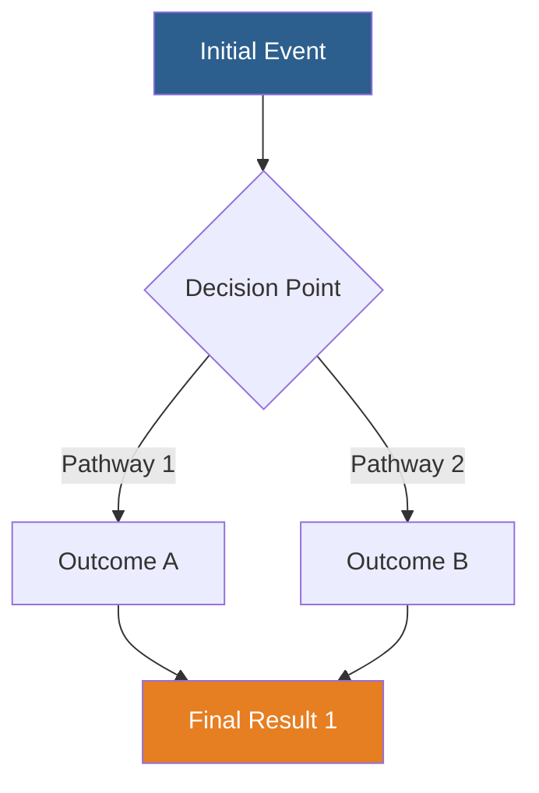

<!-- _class: lead -->

# [Presentation Title]

**[Subtitle or Topic]**

[Your Name]
[Institution/Department]
[Date]

---

# Learning Objectives

By the end of this presentation, you will be able to:

1. [Learning objective 1]
2. [Learning objective 2]
3. [Learning objective 3]

---

# Outline

1. Background and Introduction
2. [Main Topic 1]
3. [Main Topic 2]
4. [Main Topic 3]
5. Clinical Applications
6. Summary and Conclusions

---

# Background

- [Context point 1]
- [Context point 2]
- [Context point 3]

**References**: 1. Author et al. Journal. Year.

---

# [Main Concept 1]

## Key Points

- [Important point 1]
- [Important point 2]
- [Important point 3]

1,2

---

<!-- _class: explanatory -->

# In-Depth: [Complex Topic]

[Detailed explanation paragraph 1. This slide provides deeper understanding of a complex concept. Include mechanisms, pathways, or theoretical frameworks here. Aim for 150-250 words.]

[Detailed explanation paragraph 2. Continue the explanation with additional context, examples, or evidence. Connect to clinical relevance or research implications.]

**Key Takeaway**: [One-sentence summary of the main point]

**References**: 3. Author et al. Journal. Year. 4. Author et al. Journal. Year.

---

# Visual Evidence

## Figure Analysis

- **Finding 1**: [Description]
- **Finding 2**: [Description]
- **Interpretation**: [Clinical meaning]

**Figure X**. [Figure caption]
*Source*: Author et al. Journal. Year.5

---

# Mechanism Diagram

**Figure**: Simplified pathway diagram based on data from references.6,7

---

# Comparative Analysis

| Feature | Option A | Option B |
|---------|----------|----------|
| Efficacy | [Data] | [Data] |
| Safety | [Data] | [Data] |
| Cost | [Data] | [Data] |
| Availability | [Data] | [Data] |

**Table X**: Comparison of treatment options.8,9

---

# Clinical Applications

## Practical Implications

1. **Clinical Setting**: [Application]
2. **Patient Selection**: [Criteria]
3. **Implementation**: [Steps]

> **Clinical Pearl**: [Practical tip based on evidence]

---

<!-- _class: explanatory -->

# Case Study Analysis

**Clinical Scenario**: [Brief case description]

[Detailed analysis paragraph explaining the clinical reasoning, evidence-based decision making, and how the concepts presented apply to this specific case. Include diagnostic considerations, treatment options, and expected outcomes based on the literature.]

**Outcome**: [Resolution and learning points]

**References**: 10. Author et al. Journal. Year.

---

# Summary

## Key Takeaways

1. ✓ [Main point 1]
2. ✓ [Main point 2]
3. ✓ [Main point 3]
4. ✓ [Main point 4]

---

# Conclusions

- [Conclusion statement 1]
- [Conclusion statement 2]
- [Future directions or research needs]

**Clinical Bottom Line**: [One sentence summarizing the clinical impact]

---

# References

1. Author1 LastName, Author2 LastName, et al. Full article title. Journal Name. Year;Volume(Issue):Pages. PMID: 12345678

2. Author1 LastName, Author2 LastName, et al. Full article title. Journal Name. Year;Volume(Issue):Pages. PMID: 12345678

3. Author1 LastName, Author2 LastName, et al. Full article title. Journal Name. Year;Volume(Issue):Pages. PMID: 12345678

4. Author1 LastName, Author2 LastName, et al. Full article title. Journal Name. Year;Volume(Issue):Pages. PMID: 12345678

5. Author1 LastName, Author2 LastName, et al. Full article title. Journal Name. Year;Volume(Issue):Pages. PMID: 12345678

[Continue with remaining references...]

---

<!-- _class: lead -->

# Thank You

## Questions?

[Your contact information]
[Email]
