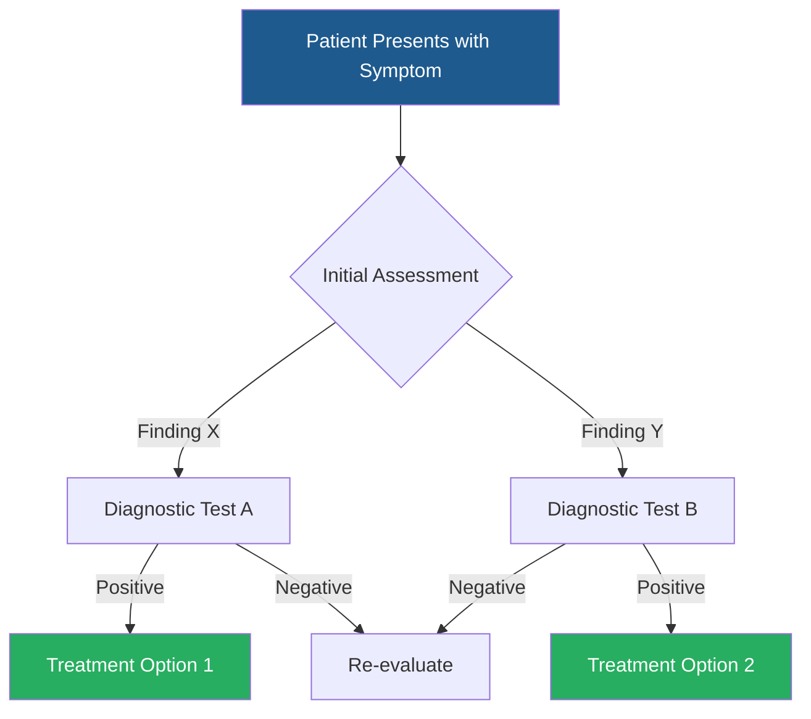

<!-- _class: lead -->

# [Module Title]
## [Specific Topic]

**[Instructor Name, Credentials]**
[Department/Division]
[Institution]

[Course/Training Program Name]
[Date]

---

# Learning Objectives

Upon completion of this module, participants will be able to:

1. [Specific, measurable objective 1]
2. [Specific, measurable objective 2]
3. [Specific, measurable objective 3]
4. [Specific, measurable objective 4]

---

# Agenda

| Time | Topic |
|------|-------|
| [0:00-0:15] | Introduction and Background |
| [0:15-0:30] | [Topic 1] |
| [0:30-0:45] | [Topic 2] |
| [0:45-1:00] | Clinical Applications and Q&A |

**Total Duration**: [X] hours

---

# Background and Context

## Why This Matters

- **Clinical Relevance**: [Why this topic is important]
- **Evidence Base**: [Current state of evidence]
- **Practice Impact**: [How this affects patient care]

**Key References**: 1,2

---

# [Main Topic 1]

## Key Concepts

- **[Concept A]**: [Brief definition]
- **[Concept B]**: [Brief definition]
- **[Concept C]**: [Brief definition]

3

---

## Understanding [Concept A]

[Practical explanation in clinical terms]

**Example**: [Brief clinical example or analogy]

---

<!-- _class: explanatory -->

# Deep Dive: [Complex Clinical Concept]

## Detailed Explanation

[First paragraph providing comprehensive explanation of the complex concept. Include pathophysiology, mechanisms, or theoretical framework. Use clear language but maintain clinical accuracy. Aim for 150-250 words total.]

[Second paragraph connecting the concept to clinical practice. Explain how understanding this mechanism or concept improves patient care, diagnostic accuracy, or treatment decisions. Include evidence-based rationale.]

**Clinical Bottom Line**: [One clear sentence summarizing the key clinical message]

**References**: 4. Author et al. Journal. Year. 5. Author et al. Journal. Year.

---

# Visual Comparison

## Approach A

**Indications**:
- [Indication 1]
- [Indication 2]

**Advantages**:
- [Pro 1]
- [Pro 2]

**Disadvantages**:
- [Con 1]
- [Con 2]

## Approach B

**Indications**:
- [Indication 1]
- [Indication 2]

**Advantages**:
- [Pro 1]
- [Pro 2]

**Disadvantages**:
- [Con 1]
- [Con 2]

**Evidence**: 6,7

---

# Clinical Decision Pathway

**Algorithm**: Evidence-based clinical decision pathway8

---

# Evidence Summary

| Study/Guideline | Level of Evidence | Key Finding | Clinical Impact |
|-----------------|-------------------|-------------|-----------------|
| [Author, Year] | [Level I-V] | [Finding] | [Impact] |
| [Author, Year] | [Level I-V] | [Finding] | [Impact] |
| [Author, Year] | [Level I-V] | [Finding] | [Impact] |

**Quality Assessment**: [Brief note on evidence quality]9-11

---

# Clinical Guidelines

## Current Recommendations

### Class I (Strong Recommendation)
- [Recommendation with strong evidence]12

### Class IIa (Moderate Recommendation)
- [Recommendation with moderate evidence]13

### Class III (Not Recommended)
- [Practice not supported by evidence]14

---

# Imaging Example

**Clinical Context**:
[Brief description of what we're looking at]

**Key Features**:
- [Finding 1]
- [Finding 2]
- [Finding 3]

**Interpretation**:
[Clinical significance]

**Figure X**: [Detailed caption]
*Source*: [Citation]15

---

# Case Study 1

**Patient Presentation**:
- Age: [X] years
- Chief Complaint: [Complaint]
- History: [Relevant history]
- Exam Findings: [Key findings]

**Question**: What is your next step in management?

---

<!-- _class: explanatory -->

# Case 1: Discussion

## Clinical Reasoning

[Detailed analysis of the case, walking through the diagnostic reasoning, differential diagnosis considerations, and evidence-based decision making. Explain why certain choices are preferred and others are not recommended.]

## Management Plan

[Specific treatment plan with rationale, expected outcomes, and monitoring parameters. Include evidence citations.]

**Learning Point**: [Key clinical lesson from this case]

**References**: 16. Author et al. Journal. Year.

---

# Did You Know?

[Interesting clinical pearl or evidence-based tip that enhances practice]

**Evidence**: [Brief citation of supporting evidence]17

---

# Common Pitfalls

❌ **Pitfall 1**: [Common mistake]
   - **Why it happens**: [Reason]
   - **How to avoid**: [Strategy]

❌ **Pitfall 2**: [Common mistake]
   - **Why it happens**: [Reason]
   - **How to avoid**: [Strategy]

❌ **Pitfall 3**: [Common mistake]
   - **Why it happens**: [Reason]
   - **How to avoid**: [Strategy]

---

# Safety Considerations

## Critical Safety Points

⚠️ **[Safety issue 1]**
   - [Prevention strategy]

⚠️ **[Safety issue 2]**
   - [Prevention strategy]

⚠️ **[Safety issue 3]**
   - [Prevention strategy]

**Always Remember**: [Key safety message]

---

# Special Populations

## Considerations for:

### Pediatric Patients
- [Key consideration 1]
- [Key consideration 2]18

### Geriatric Patients
- [Key consideration 1]
- [Key consideration 2]19

### Pregnant Patients
- [Key consideration 1]
- [Key consideration 2]20

---

# Practical Implementation

## Getting Started in Your Practice

1. **Step 1**: [Practical first step]
2. **Step 2**: [Next implementation step]
3. **Step 3**: [Ongoing practice refinement]

**Pro Tip**: [Practical advice for implementation]

---

# Quality Metrics

| Metric | Target | Monitoring Method |
|--------|--------|-------------------|
| [Metric 1] | [Target value] | [How to measure] |
| [Metric 2] | [Target value] | [How to measure] |
| [Metric 3] | [Target value] | [How to measure] |

**Benchmarks** based on national guidelines21

---

<!-- _class: explanatory -->

# Future Directions

## Emerging Evidence

[Paragraph discussing new research, ongoing trials, or emerging techniques in this area. Explain what clinicians should watch for and how practice might evolve based on current trends in the literature.]

[Second paragraph about how to stay current and continue learning in this area, including resources and professional development opportunities.]

**Stay Updated**: [Specific resources or journals to follow]

---

# Key Takeaways

## Essential Points to Remember

1. ✓ [Key point 1 - most important clinical message]
2. ✓ [Key point 2 - critical practice point]
3. ✓ [Key point 3 - important safety/quality point]
4. ✓ [Key point 4 - practical implementation tip]

---

# Summary

- **Main Concept**: [One-sentence summary]
- **Clinical Application**: [How this applies to practice]
- **Evidence Level**: [Strength of supporting evidence]
- **Implementation**: [How to start using this]

**Remember**: [Final memorable clinical pearl]

---

# Additional Resources

## For Further Learning

📚 **Reading**:
- [Reference 1 - seminal paper or review]
- [Reference 2 - clinical guidelines]

🌐 **Websites**:
- [Professional society URL]
- [Clinical resource URL]

🎥 **Videos/Demonstrations**:
- [Educational resource]

---

# References

1. Author1 LastName, Author2 LastName, et al. Article title. Journal Name. Year;Volume(Issue):StartPage-EndPage. PMID: 12345678

2. Author1 LastName, Author2 LastName, et al. Article title. Journal Name. Year;Volume(Issue):StartPage-EndPage. PMID: 12345678

[Continue with complete citations for all references cited]

---

# Assessment

## Check Your Understanding

1. [Question 1 related to learning objective 1]

2. [Question 2 related to learning objective 2]

3. [Question 3 related to learning objective 3]

*Answers and discussion available in course materials*

---

<!-- _class: lead -->

# Questions?

**Contact Information**
[Name, Credentials]
[Email]
[Office/Clinic]

**Course Materials**
[Link to additional resources]

---

<!-- _class: lead -->

# Thank You!

Continue the conversation:
[Professional social media or contact method]
