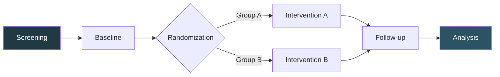
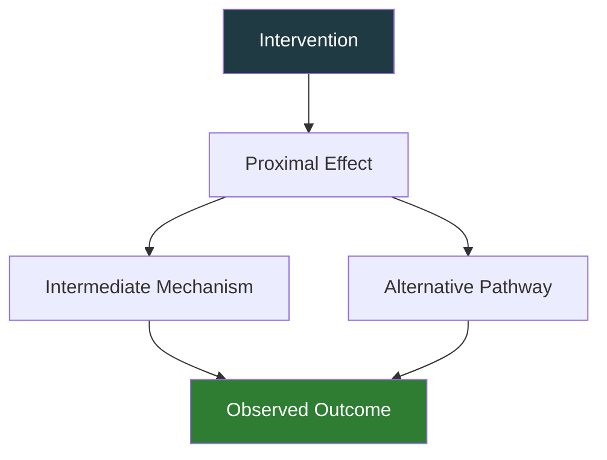

<!-- _class: lead -->

# [Research Title]

**[Subtitle or Specific Focus]**

[Principal Investigator Name]
[Co-investigators]
[Institution/Laboratory]
[Date]

[Grant/Funding Information if applicable]

---

# Research Context

## Background

- [Current state of knowledge]
- [Gap in understanding]
- [Clinical or scientific need]

**Key References**: 1-3

---

## Research Question

**[Primary research question in clear, specific language]**

### Specific Aims
1. [Aim 1]
2. [Aim 2]
3. [Aim 3]

---

# Hypothesis

## Primary Hypothesis

[Clear statement of your hypothesis]

### Rationale
[Brief explanation of why you hypothesize this, based on existing evidence]4,5

---

# Study Design

## Overview

- **Design**: [Study type - RCT, cohort, cross-sectional, etc.]
- **Setting**: [Where the study was conducted]
- **Duration**: [Study timeline]
- **Sample Size**: [N = X participants/samples]
- **Power Analysis**: [Statistical power considerations]

---

# Methods: Participants

## Inclusion Criteria
- [Criterion 1]
- [Criterion 2]
- [Criterion 3]

## Exclusion Criteria
- [Criterion 1]
- [Criterion 2]
- [Criterion 3]

**Protocol Registration**: [ClinicalTrials.gov ID or similar]

---

# Methods: Procedures

**Timeline**: [Duration details]

---

<!-- _class: explanatory -->

# Methodological Considerations

[Detailed paragraph explaining the methodological approach, rationale for specific techniques or measures used, validity and reliability considerations, and how potential confounds were addressed. This should demonstrate rigorous scientific thinking.]

[Second paragraph discussing quality control measures, blinding procedures, data monitoring, or other aspects that strengthen the study design.]

**Quality Assurance**: [Key measures taken to ensure data integrity]

---

# Outcome Measures

## Primary Outcome
- [Primary outcome with measurement method]

## Secondary Outcomes
1. [Secondary outcome 1]
2. [Secondary outcome 2]
3. [Secondary outcome 3]

**Instruments Validated**: 6-8

---

# Statistical Analysis

## Approach

- **Primary Analysis**: [Statistical test]
- **Effect Size**: [Measure used]
- **Alpha Level**: p < 0.05
- **Corrections**: [Multiple comparison corrections if applicable]
- **Software**: [Statistical package used]

---

# Results: Demographics

| Characteristic | Group A (n=X) | Group B (n=X) | p-value |
|----------------|---------------|---------------|---------|
| Age (years) | [M ± SD] | [M ± SD] | [p] |
| Sex (M/F) | [X/Y] | [X/Y] | [p] |
| [Variable 1] | [Data] | [Data] | [p] |
| [Variable 2] | [Data] | [Data] | [p] |

**Table 1**: Baseline characteristics. No significant differences between groups.

---

# Primary Outcome Results

## Key Finding

**[Primary outcome result with statistical significance]**

- Effect Size: [Cohen's d / η² / other]
- 95% CI: [Confidence interval]
- p-value: [Exact p-value]

[Statistical result formatted for emphasis]
e.g., "45% improvement (p < 0.001)"

---

# Results Visualization

**Figure X**: [Detailed figure caption explaining what is shown, including sample sizes, error bars (SEM or SD), and statistical comparisons marked]

---

## Secondary Outcomes

1. **Outcome 1**: [Result]9
   - p = [value]
   - Effect size: [value]

2. **Outcome 2**: [Result]10
   - p = [value]
   - Effect size: [value]

**Figure Y**: Secondary outcomes

---

# Subgroup Analysis

| Subgroup | Effect Size | 95% CI | p-value |
|----------|-------------|--------|---------|
| [Subgroup 1] | [d] | [CI] | [p] |
| [Subgroup 2] | [d] | [CI] | [p] |
| [Subgroup 3] | [d] | [CI] | [p] |

**Note**: [Any important findings or heterogeneity]

---

<!-- _class: explanatory -->

# Interpretation of Results

[Detailed paragraph interpreting the primary findings in context of existing literature. Explain what the results mean scientifically and clinically, how they compare to previous studies, and why differences or similarities might exist.]

[Second paragraph discussing secondary findings, unexpected results, or patterns observed in the data that merit discussion.]

**Main Implication**: [Clear statement of what this means for the field]

---

# Mechanistic Insights

**Proposed mechanism** based on current findings and literature.11,12

---

# Strengths

✓ [Strength 1 - e.g., rigorous methodology]
✓ [Strength 2 - e.g., adequate power]
✓ [Strength 3 - e.g., novel approach]
✓ [Strength 4 - e.g., clinical relevance]

---

# Limitations

1. [Limitation 1 with potential impact]
2. [Limitation 2 with potential impact]
3. [Limitation 3 with potential impact]

**Mitigation**: [How these were addressed or should be considered]

---

# Clinical Implications

## Translation to Practice

- **Immediate Applications**: [What can be done now]
- **Future Potential**: [What might be possible]
- **Patient Impact**: [How this benefits patients]

> **Clinical Significance**: [Clear statement of clinical value]

---

# Future Directions

## Ongoing/Planned Research

1. **Next Study**: [Brief description]
2. **Long-term Follow-up**: [Plans]
3. **Mechanism Exploration**: [Future aims]

**Funding**: [Current/pending grants]

---

# Conclusions

## Key Conclusions

1. [Main conclusion 1]
2. [Main conclusion 2]
3. [Main conclusion 3]

**Bottom Line**: [One-sentence summary of the study's contribution]

---

# References

1. Author1 et al. Complete citation with journal, year, volume, pages. PMID: 12345678

2. Author2 et al. Complete citation with journal, year, volume, pages. PMID: 12345678

3. Author3 et al. Complete citation with journal, year, volume, pages. DOI: 10.xxxx/xxxxx

[Continue with all references cited in the presentation]

---

<!-- _class: lead -->

# Acknowledgments

**Funding**: [Grant agencies and numbers]

**Contributors**: [Lab members, collaborators]

**Participants**: [Thank you to study participants]

---

<!-- _class: lead -->

# Questions?

**Contact Information**
[Name]
[Email]
[Lab Website]

Slides available at: [URL or QR code]

