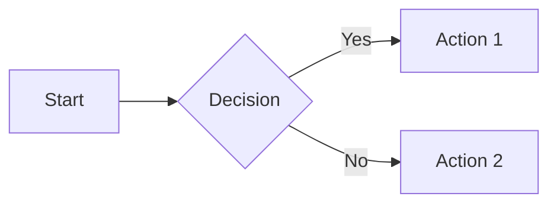

# MARP Syntax Reference

<basic_slide_structure>
```markdown
---
marp: true
theme: default
paginate: true
---

# Slide Title
Content here

---

# Next Slide
More content
```
</basic_slide_structure>

<frontmatter_options>
```yaml
---
marp: true
theme: default          # Theme name (or path to CSS)
paginate: true          # Show page numbers
backgroundColor: white  # Background color
color: black           # Text color
size: 16:9             # Aspect ratio (16:9, 4:3)
header: 'Header text'  # Header on all slides
footer: 'Footer text'  # Footer on all slides
---
```
</frontmatter_options>

<directives>
<local_directives>
Apply to current slide only:

```markdown
<!-- _class: lead -->
<!-- _backgroundColor: #123 -->
<!-- _color: white -->
<!-- _paginate: false -->
<!-- _header: "" -->
<!-- _footer: "" -->
```
</local_directives>

<global_directives>
Apply to all following slides:

```markdown
<!-- class: invert -->
<!-- backgroundColor: #123 -->
<!-- color: white -->
```
</global_directives>
</directives>

<image_sizing>
```markdown
           # Fixed width
          # Fixed height
       # Both dimensions
             # Percentage

# Short forms


# Alignment
                    # Background
               # Background on left half
              # Background on right half
                # Fit to slide
            # Contain in slide
```
</image_sizing>

<multi_column_layout>
```markdown
<div class="columns">
<div>

Column 1 content

</div>
<div>

Column 2 content

</div>
</div>
```
</multi_column_layout>

<speaker_notes>
```markdown
<!--
This is a speaker note.
It won't be visible in the presentation.
-->
```
</speaker_notes>

<math_katex>
```markdown
Inline: $E = mc^2$

Block:
$$
\int_{-\infty}^{\infty} e^{-x^2} dx = \sqrt{\pi}
$$
```
</math_katex>

<mermaid_diagrams>
````markdown

````
</mermaid_diagrams>

<common_slide_classes>
```markdown
<!-- _class: lead -->           # Centered, large text
<!-- _class: invert -->         # Inverted colors
<!-- _class: lead invert -->    # Both centered and inverted
```
</common_slide_classes>

<two_column_with_images>
```markdown
<div class="columns">
<div>

# Left Content
- Point 1
- Point 2

</div>
<div>


</div>
</div>
```
</two_column_with_images>

<best_practices>
1. **Use consistent image sizing**: Choose standard widths (e.g., 600px, 800px)
2. **Background images for impact**: Use `![bg fit]` for full-slide images
3. **Separate explanatory slides**: Use `<!-- _class: lead -->` for text-heavy slides
4. **Citation placement**: Place citations in footer or as small text at slide bottom
5. **Figure captions**: Always include below images in smaller text
</best_practices>
