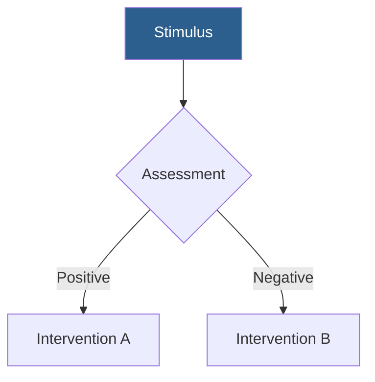

# Troubleshooting Guide

## Common Issues and Solutions

### Images Not Displaying

**Symptom**: Images don't appear in the rendered presentation

**Causes and Solutions**:
- **Path mismatch**: Verify the exact path from JSON matches what's used in markdown
- **File extension error**: Check that file extensions are correct (.jpg, .png, etc.)
- **Path separator issues**: Ensure paths use proper separators (\ or / depending on OS)
- **Relative vs absolute paths**: Use relative paths from the presentation file location

**Example Fix**:
```markdown
<!-- Wrong -->


<!-- Correct - use exact path from JSON -->

```

### Citations Missing

**Symptom**: Reference numbers not appearing or formatting incorrectly

**Causes and Solutions**:
- **Script not run**: Execute `citation_formatter.py` for each PMID
- **Format error**: Use numbered superscript format: `<sup>1,2</sup>`
- **Missing references section**: Include complete references slide at end
- **Invalid PMID**: Verify PMIDs are correct and exist in PubMed

**Example Fix**:
```bash
# Get formatted citations
python scripts/citation_formatter.py 20439832 18326821 --format numbered

# For footer citations
python scripts/citation_formatter.py 20439832 18326821 --footer
```

**Correct citation format**:
```markdown
TMS demonstrates efficacy in treatment-resistant depression.<sup>1,2</sup>

<!-- References slide -->
# References

1. Author A et al. Journal Name. 2023;10(2):123-145.
2. Author B et al. Another Journal. 2024;15(3):234-256.
```

### Theme Not Applying

**Symptom**: Presentation appears with default styling instead of chosen theme

**Causes and Solutions**:
- **Missing frontmatter**: Verify theme path is specified in YAML frontmatter
- **File not found**: Check that the theme CSS file exists at the specified path
- **Path error**: Use relative paths from presentation location
- **Syntax error in CSS**: Validate the CSS file for syntax errors

**Example Fix**:
```yaml
---
marp: true
theme: ./assets/themes/clinical-education.css
---
```

Or if presentation is in outputs folder:
```yaml
---
marp: true
theme: ../assets/themes/clinical-education.css
---
```

### Mermaid Diagrams Not Rendering

**Symptom**: Mermaid code blocks appear as text instead of rendered diagrams

**Causes and Solutions**:
- **MARP version**: Ensure you're using MARP CLI with Mermaid support
- **Syntax error**: Validate Mermaid syntax at mermaid.live
- **Too complex**: Simplify diagram (max 8-10 nodes recommended)
- **Missing configuration**: Check MARP engine settings

**Example Fix**:
````markdown
<!-- Correct Mermaid block -->

````

### PubMed MCP Connection Issues

**Symptom**: Cannot access PubMed MCP tools

**Causes and Solutions**:
- **MCP not installed**: Install PubMed MCP server
- **Not connected**: Check MCP server status
- **Permissions**: Verify MCP server has network access
- **Use fallback**: Switch to web_search for PubMed queries

**Fallback workflow**:
```markdown
When PubMed MCP unavailable:
1. Use WebSearch to find PubMed articles
2. Manually extract PMIDs from search results
3. Use citation_formatter.py with PMIDs
4. Search PMC manually for images if needed
```

### Image Quality Issues

**Symptom**: Downloaded images are low resolution or pixelated

**Causes and Solutions**:
- **Source resolution**: PMC images vary in quality
- **Wrong image file**: Some articles have multiple resolutions
- **Scaling issues**: Don't upscale images beyond original size
- **Format choice**: Use PNG for diagrams, JPG for photographs

**Best practices**:
- Request specific resolutions in scripts: `--width 800`
- Check image metadata for available resolutions
- Use vector formats (SVG) when available
- Don't specify dimensions larger than original

### Script Execution Errors

**Symptom**: Python scripts fail to execute

**Common errors and fixes**:

**Import errors**:
```bash
# Install missing dependencies
pip install requests --break-system-packages
pip install scikit-learn --break-system-packages
pip install polars --break-system-packages
```

**Permission errors**:
```bash
# Make script executable
chmod +x scripts/script_name.py

# Run with python explicitly
python scripts/script_name.py
```

**Path errors**:
```bash
# Use absolute paths
python /full/path/to/script.py

# Or run from skill directory
cd ~/.claude/skills/biomedical-marp-presentations
python scripts/script_name.py
```

### Contextual Fetcher Low Scores

**Symptom**: All relevance scores are below 0.3

**Causes and Solutions**:
- **Context too vague**: Make context_description more specific
- **Wrong keywords**: Update keywords to match domain terminology
- **Query too narrow**: Broaden PMC query to retrieve more articles
- **TF-IDF not installed**: Install scikit-learn for better matching

**Example improvement**:
```json
// Before (vague)
{
  "context_description": "Information about TMS",
  "keywords": ["TMS"],
  "pmc_query": "TMS"
}

// After (specific)
{
  "context_description": "Physical design and electromagnetic field characteristics of figure-8 versus H-coil configurations for transcranial magnetic stimulation",
  "keywords": ["figure-8 coil", "H-coil", "electromagnetic field", "coil geometry"],
  "pmc_query": "transcranial magnetic stimulation AND (coil design OR coil configuration) AND (figure-8 OR H-coil)"
}
```

### Open-I Search Returns No Results

**Symptom**: Advanced Open-I search finds no images

**Causes and Solutions**:
- **Filters too restrictive**: Remove some filters and try again
- **Query too specific**: Simplify search query
- **Specialty mismatch**: Try broader specialty or remove filter
- **Collection unavailable**: Try different collection filter

**Troubleshooting steps**:
```bash
# 1. Start broad
python scripts/openi_advanced_search.py --query "brain" --max-results 10

# 2. Add one filter at a time
python scripts/openi_advanced_search.py --query "brain" --modality mri --max-results 10

# 3. Check available options
python scripts/openi_advanced_search.py --help
```

### Two-Column Layout Not Working

**Symptom**: Two-column layout appears as single column

**Causes and Solutions**:
- **Missing CSS class**: Ensure theme supports `.columns` class
- **Syntax error**: Check div structure and closing tags
- **Content too wide**: Reduce content width within columns

**Correct structure**:
```markdown
<div class="columns">
<div>

Left content here
- Bullet points
- Work fine

</div>
<div>

Right content here


</div>
</div>
```

**Common mistakes**:
```markdown
<!-- Missing blank lines after <div> -->
<div>
Content here  <!-- Won't render correctly -->
</div>

<!-- Not closing divs -->
<div class="columns">
<div>
Left
<!-- Missing </div> -->
```

### Presentation Too Long

**Symptom**: Presentation exceeds target duration

**Solutions**:
- **Reduce explanatory slides**: Keep only most critical deep dives
- **Consolidate bullets**: Combine related points
- **Remove redundancy**: Check for duplicate information
- **Split content**: Consider making this a series of presentations
- **Faster pacing**: Reduce transition slides and repetition

**Guideline**:
- 1-2 minutes per slide average
- 30-40 slides for 1-hour presentation
- Include 10 minutes for Q&A

### YAML Frontmatter Errors

**Symptom**: MARP doesn't recognize presentation settings

**Common errors**:
```yaml
# Wrong - extra spaces
marp : true

# Wrong - missing quotes for paths with spaces
theme: ./path with spaces/theme.css

# Correct
marp: true
theme: "./path with spaces/theme.css"
```

**Complete valid frontmatter**:
```yaml
---
marp: true
theme: ./assets/themes/clinical-education.css
paginate: true
footer: 'Author Name | Institution | Date'
size: 16:9
---
```

## Getting Help

If you encounter issues not covered here:

1. **Check reference files**: Review other reference files for related guidance
2. **Validate syntax**: Use online validators for Mermaid, YAML, JSON
3. **Test components**: Isolate the issue by testing individual components
4. **Check versions**: Ensure MARP CLI and dependencies are up to date
5. **Review examples**: Look at template files in `assets/templates/`
6. **Script debugging**: Run scripts with `python -v` for verbose output
